# NatureEd FullStackAngular App
    This application is for children to provide knowledge on Nature and creations where they can search information on 
    different animals and get information on plants. They can also use image gallery to learn about different sets of images,
    watch videos. This application also has note taking feature which can help them take notes, save note, edit notes and delete notes. 
    We have also included calculator for them to do arithmetic functions and small quiz feature to increase their knowledge.

# Technologies Used : 

    This project was generated with : 
    - Angular Front-End,
    - Java Back-End 
    - MySQL

## Development Server

 If app does not function upon running `ng serve --open `, 
 you may need to run following command on gitBash once you clone the repo  : 

    - npm install
    - npm install --save @angular/material
    - npm install --save @ng-bootstrap/ng-bootstrap
    
Then Run `ng serve --open ` in a command line to open the project . 
    It will automatically navigate to `http://localhost:4200/`. 
    The application will automatically reload if you change any of the source files.

## For Back-end Database Connection : 
- add / copy below 3 lines of code in application.properties under src/main/resources   or  create config/application.properties and copy under that for security. Update this with your own IP (if not localhost), schema, and your username and password :

- spring.datasource.url=jdbc:mysql://localhost:3306/ add database-name here e.g.(educationdb)?useSSL=false&serverTimezone=America/Detroit
- spring.datasource.username=root
- spring.datasource.password=password

       
## Langauges and Tools Used : 

* Angular
* HTML
* CSS
* Javascript
* Typescript
* DOM Manipulation
* ngFor and ngModel Directive attributes
* Java 
* MySQL

## Website

https://github.com/miraj00/EducationAppFullStackAngular

## Outcome ( Screenshot )

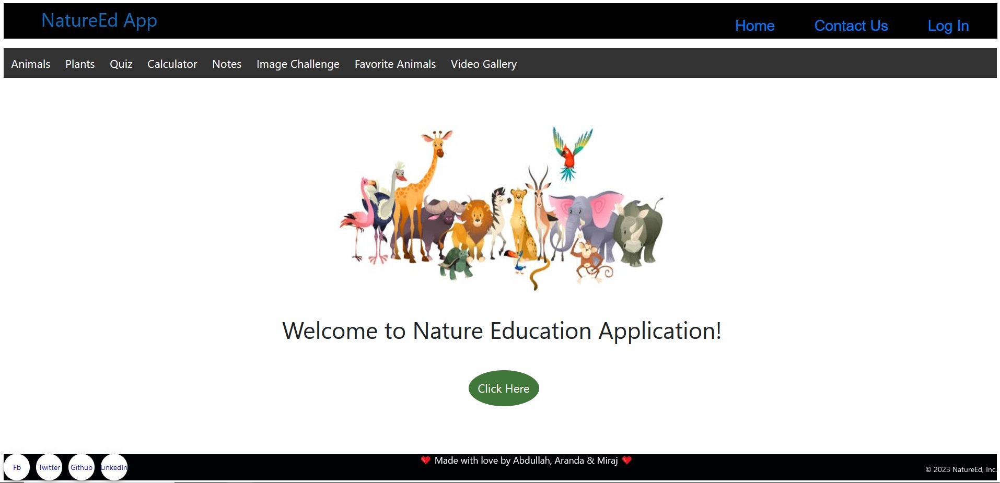  
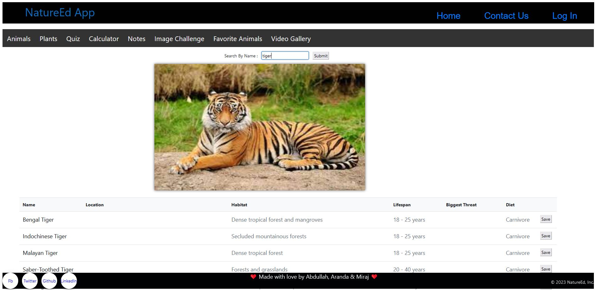
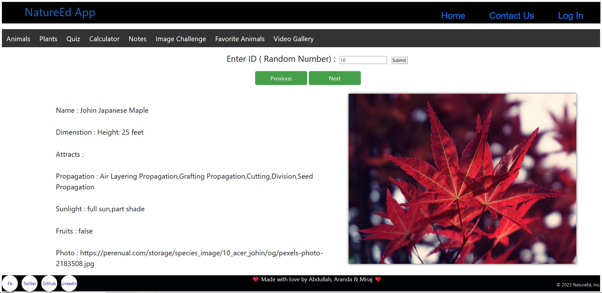  
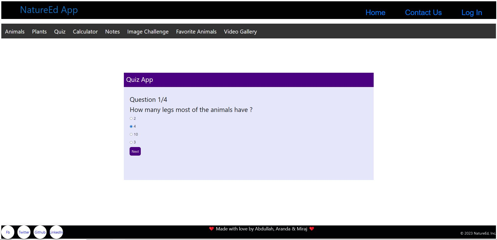
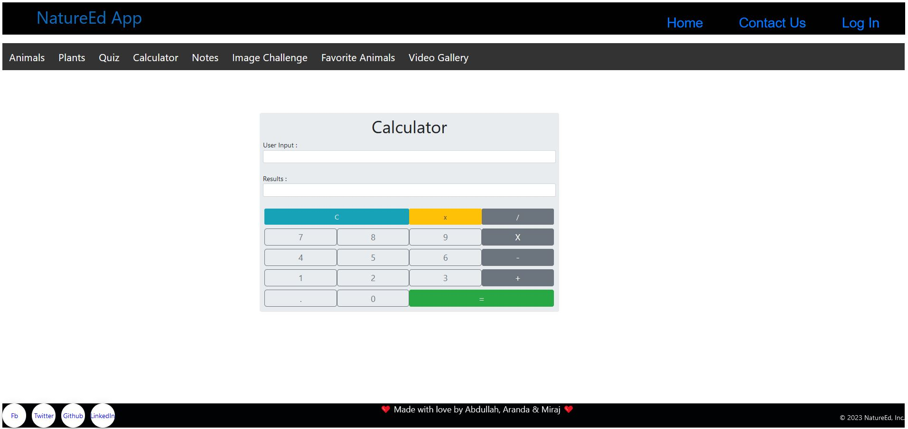  
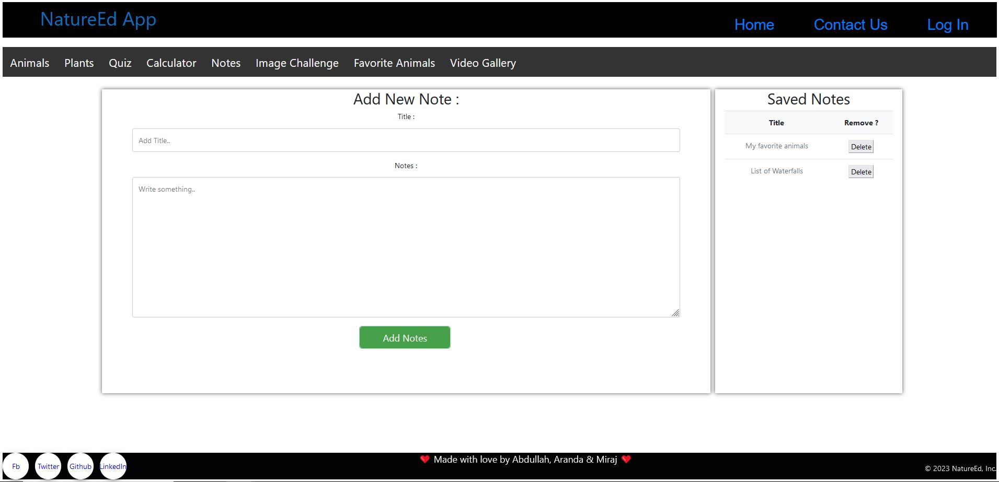
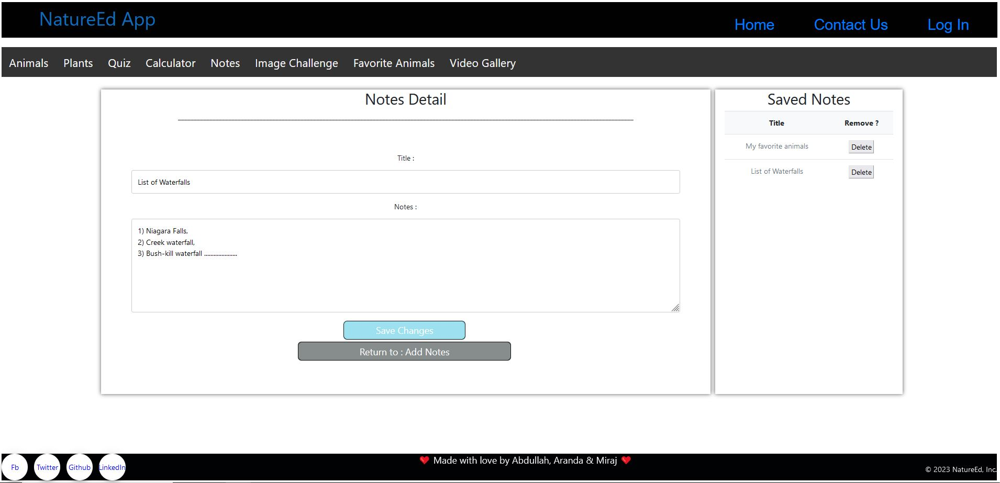  
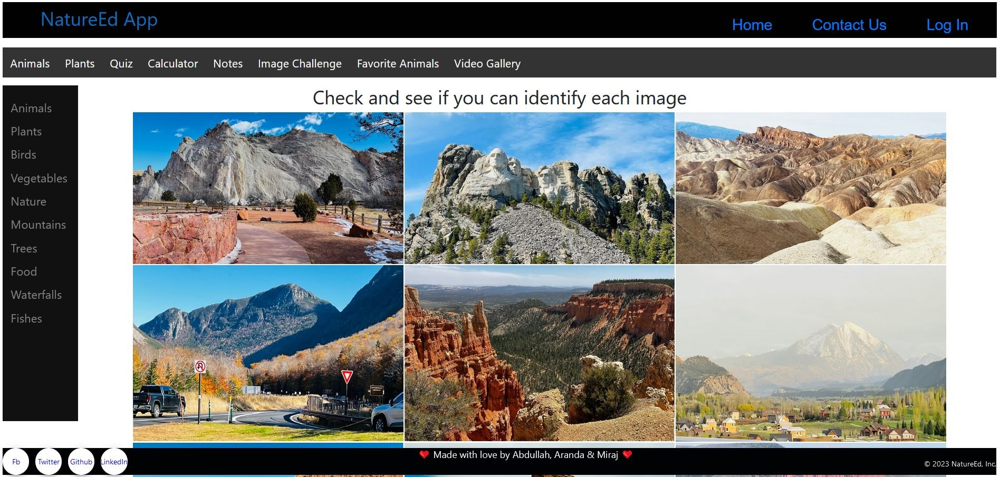
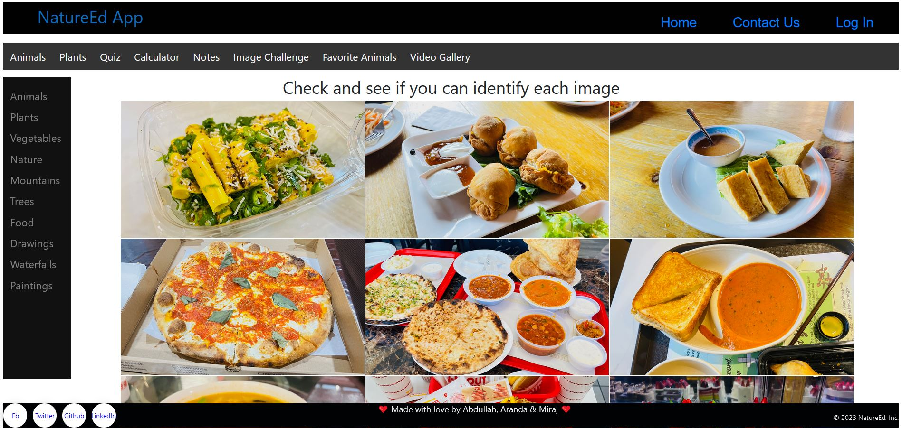  
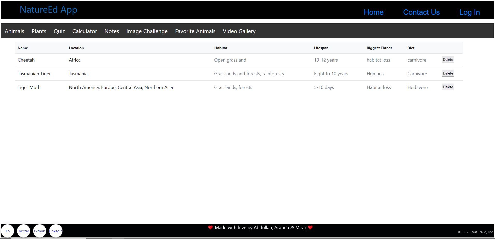
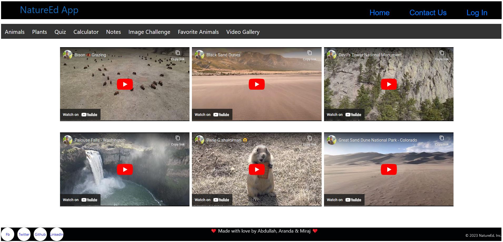  
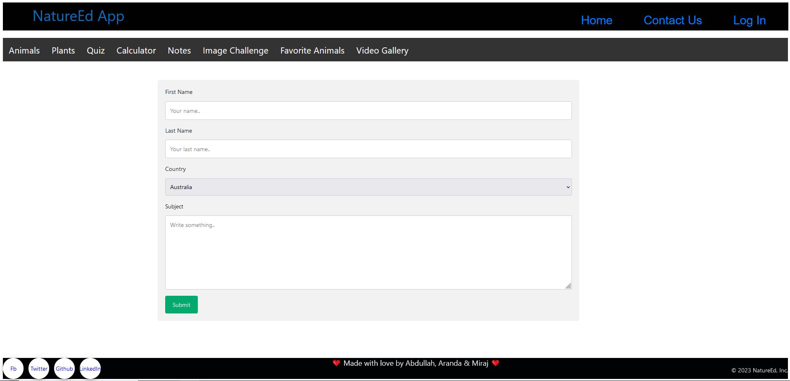
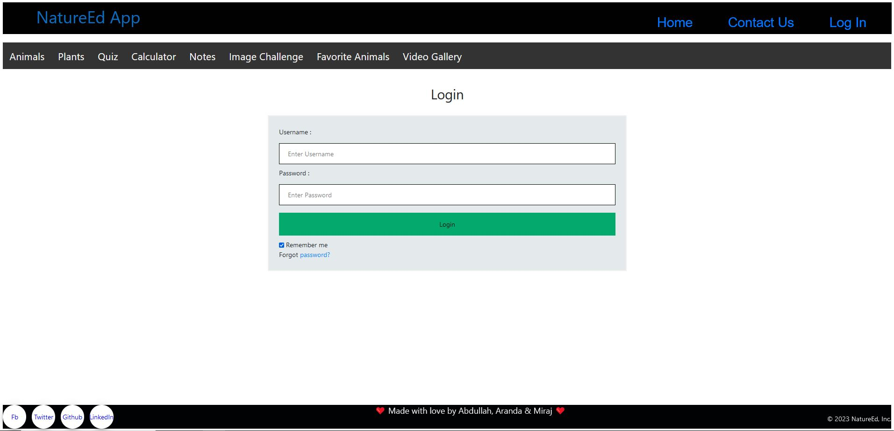

